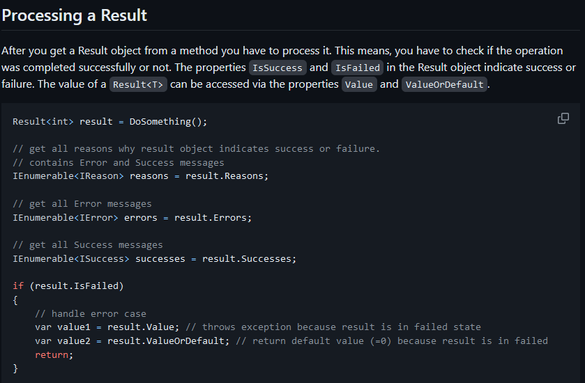
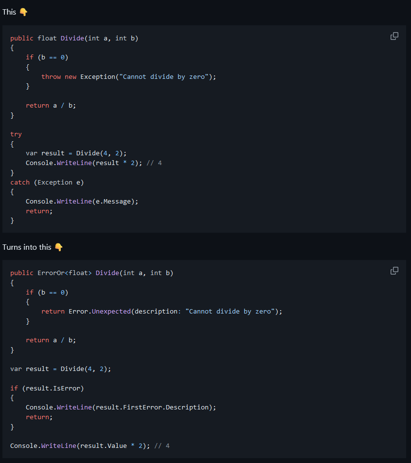

As many people know, I reaaaally like functional programming and the ideas that come from it. Among them, two are getting popularity recently: the "Result pattern" and "Option pattern".

While browsing across Reddit, I found one thread that was asking for a good C# library that implements the Result type, and I would like to analyse in this article why I like to use this types, what I like about them, and what I don't like about certain implementations. But before it, let's begin with some definitions.

## What's an Option type?

An option type is a type that can have a value or not. Depending on the language, it receives different names: Some/None in F#/Rust or Just/Nothing in Haskell, but the concept is the same.

This type encapsulates the absence of value, removing effectively null from your code.

## What's a Result type?

Result is similar to Option, in the sense that it has two different values, Ok/Error (F#), Ok/Err (Rust), and encapsulates the result of an operation, hence the name.

The purpose of this class is to remove the need of throwing exceptions, as many people see exceptions as a glorified goto statement.

This two types can be generalised (and it is often done) through a generic Either type: a type that can have 2 different variants.

## Why you should use this types

Imagine you want to fetch some data, do some calculations and then print it. You will do something like:

```csharp
var data = fetchData();
var dataProcessed = data != null ? processData(data) : null;

if (dataProcessed != null)
{
    print(data);
}
else
{
    print("No data");
}
```

Okay, for sure you can refactor this with early returns, and improve it, but the problem is still there: fetchData returns something that can be null, and if we pass that null into processData, something will break, probably with a NullReferenceException (NRE). So, how can we fix this?

With C# 8, Nullable Reference Types (NRT) were added, allowing you to be explicit about when something can be null and act upon it. It is a great feature and I like it, but you still can disable it, it is not enforced by the compiler, and the fact that no annotations means no warnings, is infuriating to me (Note: this is called null oblivious and, as far as i know, there is no way to tell the compiler "treat everything that is null oblivious as nullable"). So, now code like:

```csharp
string? value = null;

value.Trim();
```

Will generate a warning, as value can be null. This is, of course, not enough.

As for exceptions, question:

```csharp
try
{
    doSomething();
}
catch(ApplicationException app)
{
    print("ApplicationException");
}
catch(SystemException sys)
{
    print("SystemException");
}
catch(ArgumentException arg)
{
    print("ArgumentException");
}

doSomething() => throw new ArgumentOutOfRangeException();
```

Will any of the catch blocks trigger? And which ones? Good luck with that.

## Removing NRE with the option type

Now let's do the same thing, using the option type. I will use Rust in this example.

```rust
let processed_data = fetch_data().map(process_data);

processed_data match {
    Some x => println!("Has data {}", x),
    None => println!("No data");
}
```

Comparing it:

- Conditionals are gone.
- Code now reads as a pipeline of processing data.
- It is impossible for you to get a NRE unless you purposely want to, using unwrap/expect.

## Cleaner error processing with Result type

Same thing:

```rust
let result = do_something();

result match {
    Ok(f) => // Manage result if needed
    Err(e) => match e {
        FileNotFound => println!("File not found"),
        FileInUse => println!("File in use"),
        ....
    }
}
```

Now it is clear where it is going to end. In case of exception, you go to the Err branch. Always. You are not jumping around, you don't have to guess.

## The state of C# libraries

As I said in the beginning, this comes from a Reddit thread that asked for guidance on the Result type, and this were the ones recommended:

- [FluentResults](https://github.com/altmann/FluentResults)
- [ErrorOr](https://github.com/amantinband/error-or)
- [CSharpFunctionalExtensions](https://github.com/vkhorikov/CSharpFunctionalExtensions)
- [LanguageExt](https://github.com/louthy/language-ext)
- [Funcky](https://github.com/polyadic/funcky)

You can take a look at them if you want. They are all really good and do their work correctly, but there is something that irks me whenever I see this kind of types used.

I maybe have spoiled it before when talking about the option type and how it avoids the NRE. The point about this types is that they act as monads. What's a monad you ask? Well, a monad is a monoid in the categor... I'm joking. Lets not explain monads like that.

Monads are a concept of functional programming which has a lot of good applications and there are way [better](https://fsharpforfunandprofit.com/posts/monoids-without-tears/) [explanations](https://blog.ploeh.dk/2022/03/28/monads/) that any I can do.

But to summarise, the problem is that you [don't get the value out of the monad](https://www.youtube.com/watch?v=F9bznonKc64). You inject the behaviour into the monad.

Lets see for example FluentResults.

You do something that returns a Result, and then check if it has failed to do some processing. But what if I forget about checking for IsFailed? Exactly. You get an exception, which is precisely the scenario you were trying to avoid.

Same thing happens with _ErrorOr_:

Call me crazy, but if you remove the `IsError` line, you have exactly the same thing as before. I can't see the improvement.

_CSharpFunctionalExtensions_ has exactly the same problem, if you forget to check for values, then you have errors all over the place. Avoidable errors.

## So how is this done correctly?

Just look at [Funcky's explanation](https://polyadic.github.io/funcky/book/option.html#how-can-i-get-the-value). You don't get the value out, you pass the behaviour into it. Taking this principle into account, lets rewrite the previous example:

```csharp
public Result<float> Divide(int a, int b)
{
    if (b == 0)
    {
        return Result.Error("Cannot divide by zero");
    }

    return Result.Ok(a / b);
}

var result = Divide(4, 2);
result.Match(v => v\*2, Console.WriteLine);
```

Not only it is shorter, it also has the benefit of never breaking due to a missed check. Same thing applies for option type. You Match against it, Map it... whatever, but you don't get the value out directly.

## Summary

So this is getting long and has taken too many days to complete. So briefly:

- Option and Result are very good patterns that will make your code read better and remove common avoidable exceptions.
- There are great libraries in C# that supply this two types, and many more, with extensions for easier use.
- Monads are awesome but, most importantly
  
